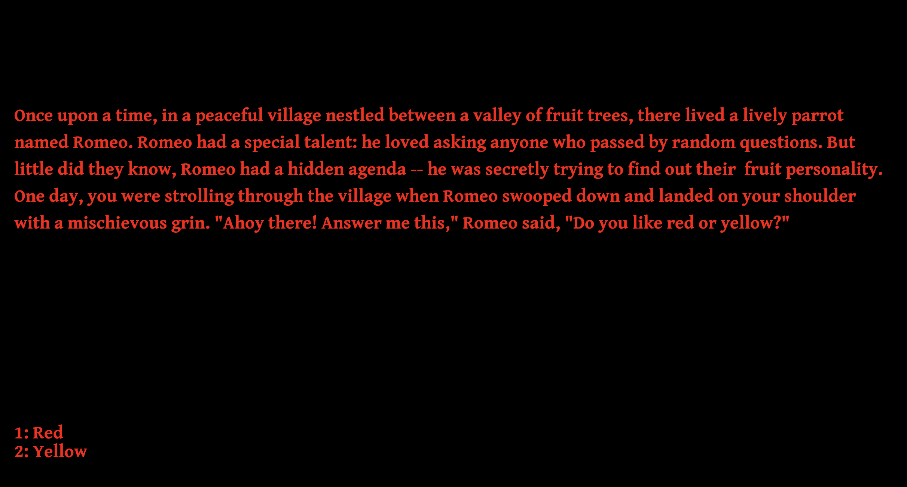

# (Fruit Personality)

Author: Zixin Qiu

Design: The game asks a series of random questions that lead to useless(but funny) conclusions.

Text Drawing: The shader and font loading is adapted from the website: https://learnopengl.com/In-Practice/Text-Rendering

Choices: the game stores story and narrative in the Story structure that contains nodes of choices

Screen Shot:

How To Play:

Press number 1 and 2 on the keyboard to select different choices

Sources: (TODO: list a source URL for any assets you did not create yourself. Make sure you have a license for the asset.)

This game was built with [NEST](NEST.md).

